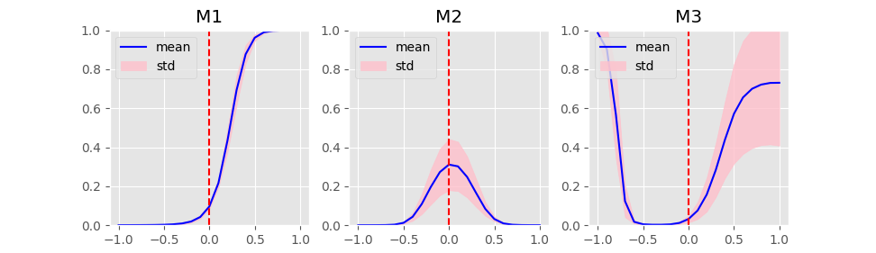

# BCI-Attention
A repository including multiple attentional module designs for brain signal recognition tasks.
Scripts should run with `tensorflow>=2.8.0`  
Preprints associated with this repo:  
    * [KAM -- a Kernel Attention Module for Emotion Classification with EEG Data](https://arxiv.org/abs/2208.08161)  
    * [A Monotonicity Constrained Attention Module for Emotion Classification with Limited EEG Data](https://arxiv.org/abs/2208.08155)  

------

### File Briefs  
  ##### Training
`cv_exp.sh`: Bash script for calling `exp_5CV_SEED.py` with data from different subjects in SEED dataset.  
`DEAP_benchmark.sh`: Bash script for calling `DEAP_test_gen.py` specifying different subjects, experiment types and models with DEAP dataset.  
`exp_5CV_SEED.py`: Main script for training with SEED dataset. One should manually change models used in the script.  
`DEAP_test_gen.py`: Main script for training with DEAP dataset.  

  ##### Explorations, Analysis and Visualizations 
  These are less organised scripts. They were written as our experiments goes. So you probably will not use all contents in a given script, but just some parts of it for your purpose. 
  
  `DEAP_Plots.py`: Gather metrics from trained models with DEAP for benchmarking, analysis and make some visualizations.  
  `SEED_extra_plot.py`: Gather metrics from trained models with SEED for benchmarking, analysis and make some visualizations.  
  `sigma_effect.py`: Scripts for exploring the Kernel Attention Module (KAM)'s effect on backbone network with SEED dataset.
  
  ##### Other supporting files  
  The folder `scalp_map` contains matlab files for making scalp maps.  
  `Modules.py`: Contains custom layers used for constructing network models.  
  `Models.py`: Contains different network models.
   `Utils.py`: Some utility functions
   `Visual.py`: Some function for general visualization purpose. 
   
------
### Demo Plots
Figures below are:  
  * A simple demo of the idea of prediction transition curve on trinary classification tasks.   
  * The prediction transition curve under different models given the same input samples from SEED dataset. 
  * Track of accuracies when different frequencies are filtered out from input samples.  
  * The map from deep gram matrix's element to attention matrix's element learned by MCAM module  
  * Different scalp patterns (kernel weights of the first Depthwise convolutional layer) when various attention modules are inserted. First row: mean, second row: std, third row: top-5 correlated channel pairs (red: +, blue: -).  
  * The effect of different $\alpha$ value on layer dense layer's output. Visualized via UMAP.
 <!--  -->

  
  
  

